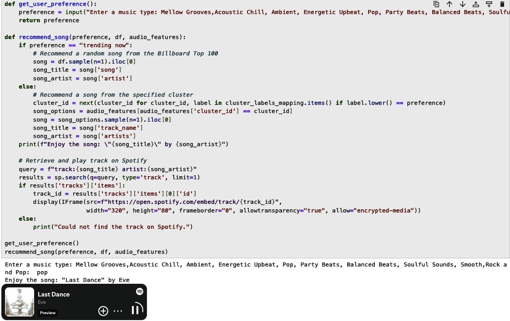
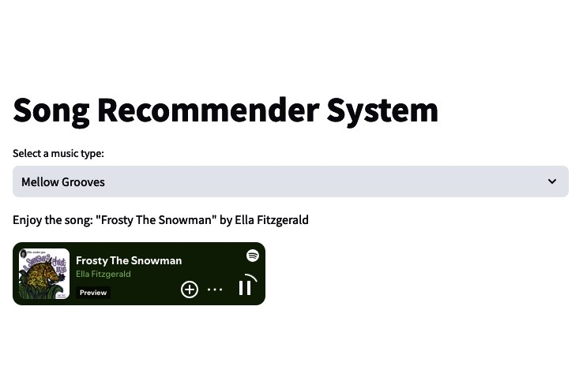

# 💻 Song Recommender System: Unsupervised Machine Lerning Project
Welcome to my Song Recommender System—a tool designed to tailor song suggestions based on a blend of your musical preferences, mood, and style. By integrating data from Billboard's Hot 100 through web scraping and an additional set called "audio_features_curated".

• Within "audio_features_curated", songs are grouped into engaging clusters such as pop, ambient, acoustic chill, energetic upbeats, mellow grooves, and more.

• Following the creation of a Billboard's Hot 100 DataFrame, a streamlined process is established that allows users to select "trending now" and instantly receive a song recommendation from the curated top 100 list.

• Finally, the setup features a function that retrieves song recommendations tailored to user preferences, offering options aligned with selected clusters or the "trending now" list. Designed with a Streamlit app and linked to Spotify’s API, the system makes it easy and enjoyable to discover your next favorite track.

# 📊 Data Sourcing:
• Billboard's Hot 100: Data obtained through web scraping to identify popular trends.(www.billboard.com/charts/hot-100/)

• audio_features_curated: This dataset offers songs with attributes like speechiness, liveliness, and acousticness, which highlight each track's distinct sonic qualities and musical characteristics. It's a valuable resource for diving into analysis and creating personalized song recommendations. (audio_features_dataset_curated.csv)

# 📐 Preprocessing Steps Applied to "audio features dataset curated":

• After cleaning and wrangling the data, I focused on keeping 9 important features for the machine learning project, setting aside the rest that weren't needed.

# 💡 Machine Learning Approach:

In my project, I used K-Means Clustering to group songs into distinct clusters by analyzing their audio feature similarities. Before clustering, I applied the Standard Scaler to ensure each feature contributed equally to the analysis. To decide on the right number of clusters, I applied the distortion score elbow method and checked the Silhouette Score. This way, I ensured that each cluster is well-defined and truly represents the different sounds.

# ⚙️ System Integration:

Spotify API's credentials and the client ID, are stored and secured via .gitignore to prevent exposure. These credentials are essential for running the function and displaying songs through Spotify's embedded player. Visitors to the GitHub repository will need their own Spotify credentials and client ID to operate the app. For assistance in setting up their credentials or running the project, they are welcome to contact me.

1) After preprocessing the datasets and setting up functions like get_user_preference() and recommend_song(). Next, I transitioned to Visual Studio Code to build the Streamlit application. It integrates everything seamlessly, allowing users to easily obtain personalized song recommendations directly from the app. I saved the script as song_recommender.py in the project's directory.

2) To run song_recommender.py with Streamlit, I opened the terminal on my Mac/Intel system and I simply copied the full path to where the file is stored and pasted it. Once there, I ran the Streamlit command to launch the app. (streamlit run "/Users/admin/Downloads/project/project_week_11/song_recommender_final /song_recommender_final.py")
  
3) Streamlit generated a local link (http://localhost:8501). By opening it in my browser, I easily accessed and interacted with the app, experiencing its features in real-time.

Enjoy! 😎. Thank You.

# 

#  

